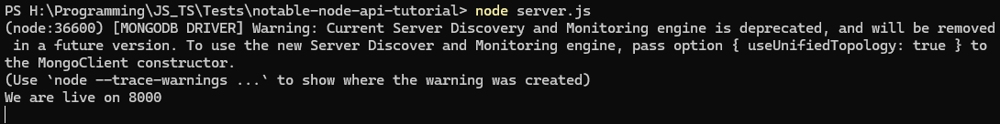
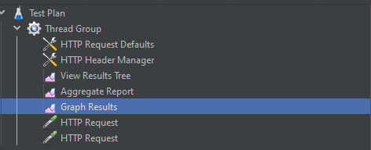
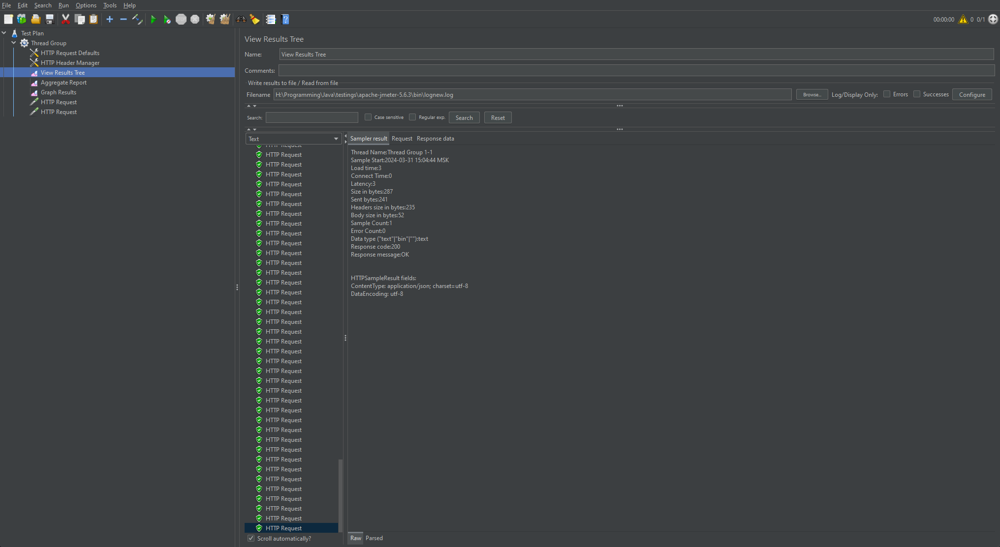
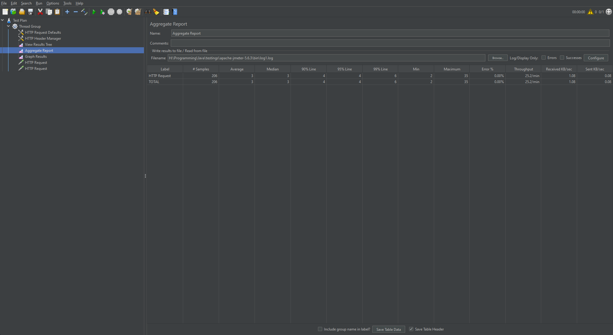
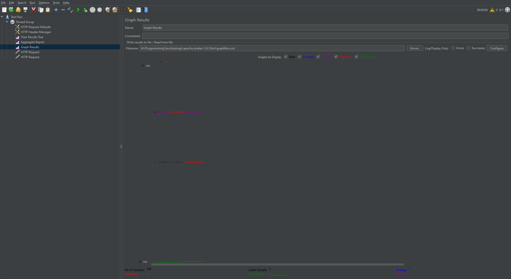
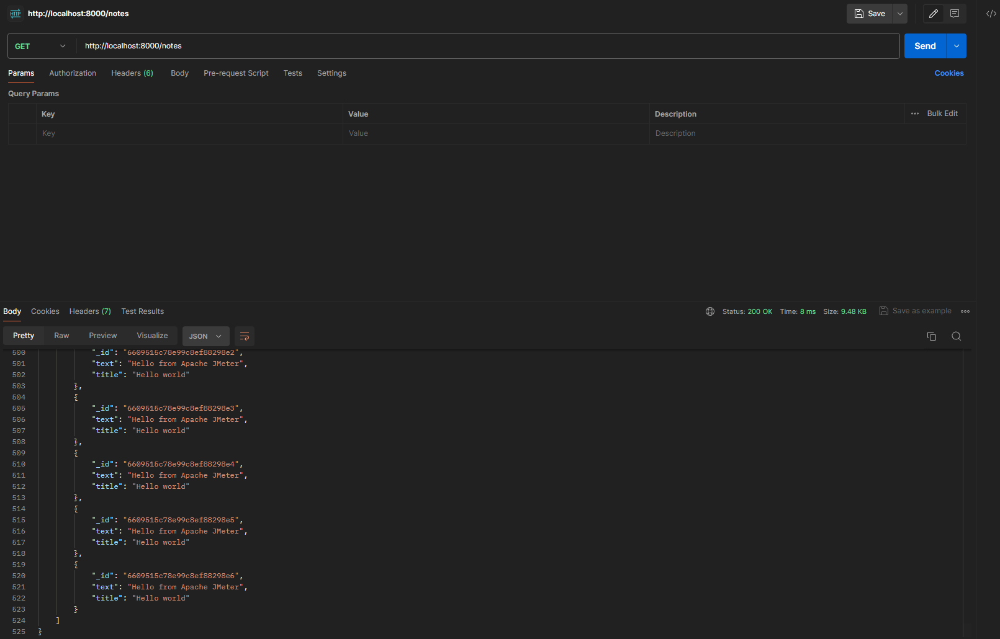

## Нагрузочное тестирование

В ходе лабораторной работы мы установили тестовый [Notable API](https://github.com/bunnies-group/notable-node-api-tutorial/tree/master), базу данных MongoDB и Apache JMeter, благодаря чему смогли провести нагрузочное тестирование API.

### Ход работы:

1. Запустили MongoDB и Notable API

2. Настроили тестовый план в JMeter:

    

3. Запустили тесты в JMeter:

    1. Результаты запущенных тестов:

    

    2. Результат в видео отчета:

    

    3. График результатов:

    

4. Проверли что данные сохранились в БД:

