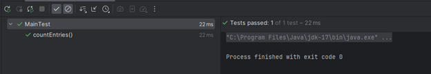

### Задание № 1

В ходе выполнения задания была написана программа решения квадратного уравнения ах2 + bх + с = 0. Программа находится в папке [task1](/task1)

### Задание № 2

Для тестирования программы выбран набор тестов представленный в таблице:

Номер теста |   a   |   b   |   c   | Ожидаемый результат | Что проверяется
----------- | ----- | ----- | ----- | ------------------- | ---------------
1           | 2     | -5    | 2     | x1=2, x2=0.5        | Случай вещественных корней
2           | 3     | 2     | 5     | Сообщение           | Случай комплексных корней
3           | 3     | -12   | 0     | x1=4, x2=0          | Нулевой корень
4           | 0     | 0     | 10    | Сообщение           | Неразрешимое уравнение
5           | 0     | 0     | 0     | Сообщение           | Неразрешимое уравнение
6           | 0     | 5     | 17    | Сообщение           | Неразрешимое уравнение
7           | 9     | 0     | 0     | x1=x2=0             | Нулевые корни

Результаты тестирования:

### Задание № 3

В ходе выполнения задания мы разработали консольное приложение, которое считает количество вхождений второй строки в первую. Программа находится в папке [task2](/task2)

Для тестирования программы выбран набор тестов представленный в таблице:

Строка 1          | Строка 2 | Вывод
----------------- | -------- | ---
абвгабвг          | аб       | 2
hhfdfg235dxhfc    | hf       | 2
привет            | привет   | 1
привет            | тевирп   | 0
@1                | @#@fdg№1 | 0
1                 | 11       | 0

Результаты тестирования:

