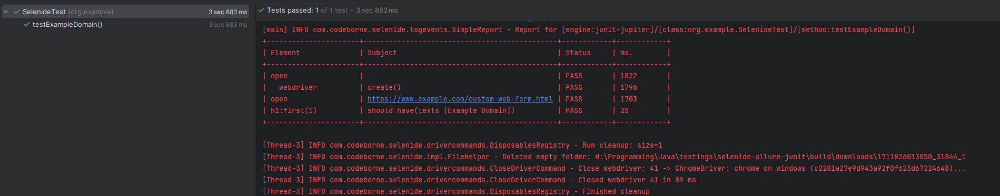
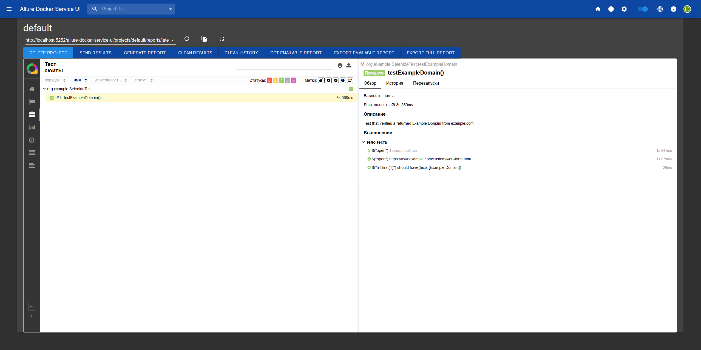

# Тестирование с помощью Selenide + Allure + JUnit

В ходе выполнения задания была создана программа, которая получает текст с [сайта](https://www.example.com/custom-web-form.html) и сравнивает результат с "Example Domain". Код программы находится в папке [src](/src). Дополнительно сделано создание отчетов для Allure.

Инструкция по первому запуску Allure:
1. Запускить тесты, если все прошло успешно, то появится папка allure-results.
2. После в папке проекта (там же, где папка src) необходимо прописать:
   1. `docker run -p 5050:5050 -e CHECK_RESULTS_EVERY_SECONDS=NONE -e KEEP_HISTORY=1 -v "${PWD}/allure-results:/app/allure-results" frankescobar/allure-docker-service`
   2. `docker run -p 5252:5252 -e ALLURE_DOCKER_PUBLIC_API_URL=http://localhost:5050 frankescobar/allure-docker-service-ui`

Результаты:

