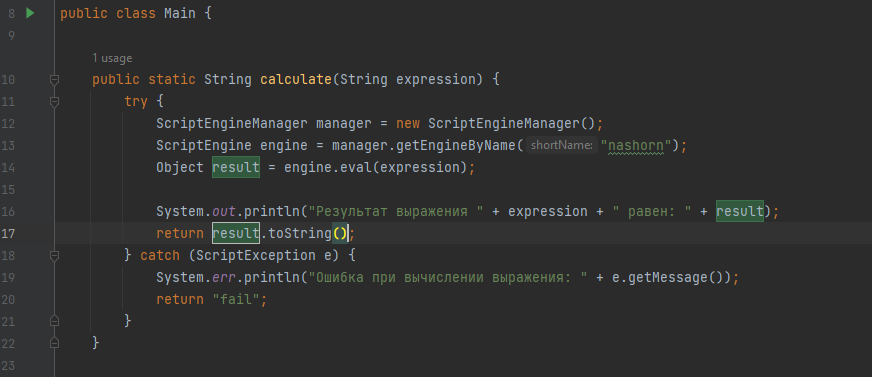

## Нагрузочное тестирование, стрессовое тестирование

### Задание № 1

В ходе выполнения задания был написан компилятор простых арифметических выражений:

## Задание № 2

Тестовый сценарий нагрузочного тестирования:

Приложение может обработать 80 запросов в секунду при условии, что они идут последовательно.
График зависимости времени ответа от количества параллельных запросов:

Запросы	| Время ответа
------- | -------------
1       | 444 мс.
2	    | 466 мс.
4	    | 489 мс.
8	    | 495 мс.
16	    | 522 мс.
32	    | 650 мс.

Максимальное количество параллельных запросов, которое может обработать приложение без сбоев – 9000.
